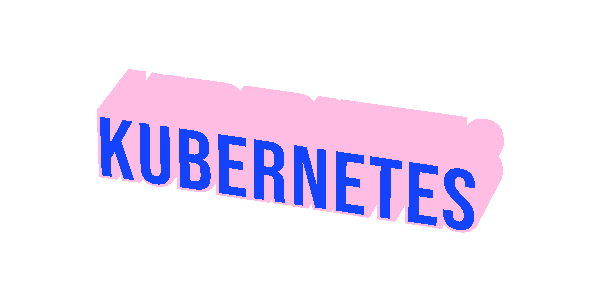

<h1 align="center">Hi! 👋 I'm Askold</h1>
<h3 align="center">A passionate Java developer</h3>
<h3 align="center">▙ I’m currently learning Spring Framework</h3>

  
  
  
  
  
  
  
  
  
  

<picture>
  <source media="(prefers-color-scheme: dark)" srcset="https://raw.githubusercontent.com/adarnopyh/adarnopyh/output/github-snake-dark.svg" />
  <source media="(prefers-color-scheme: light)" srcset="https://raw.githubusercontent.com/adarnopyh/adarnopyh/output/github-snake.svg" />
  
</picture>

# 💻 Tech Stack:
                           
# 📊 GitHub Stats:
 
 

### ✍️ Random Dev Quote

---

<!-- Proudly created with GPRM ( https://gprm.itsvg.in ) -->